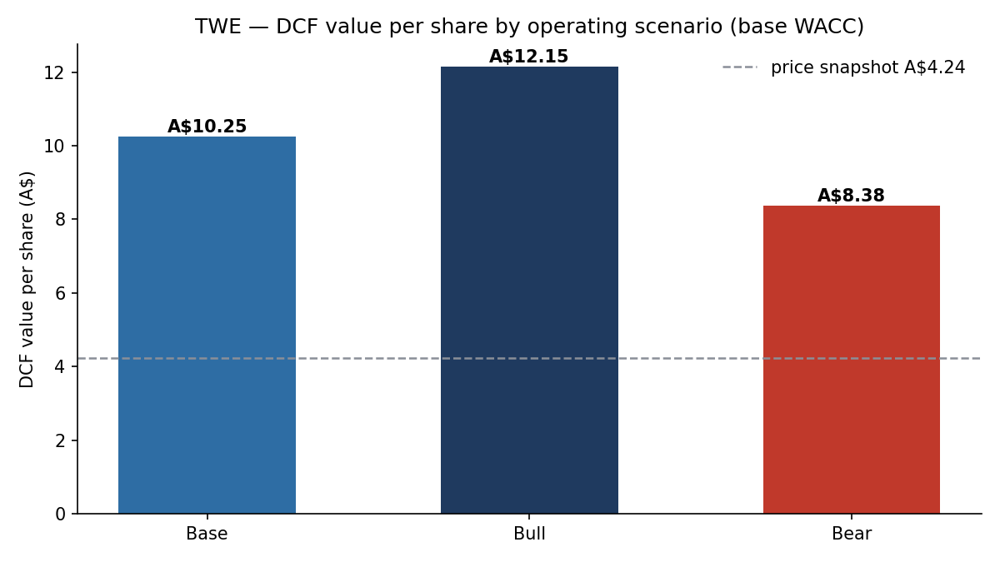
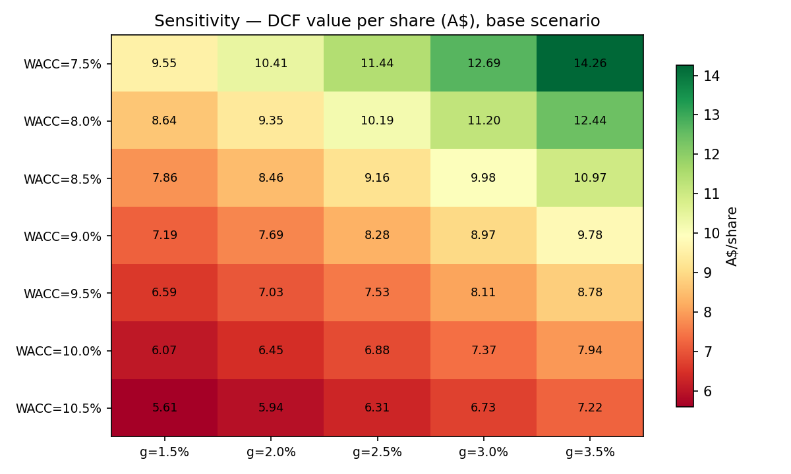
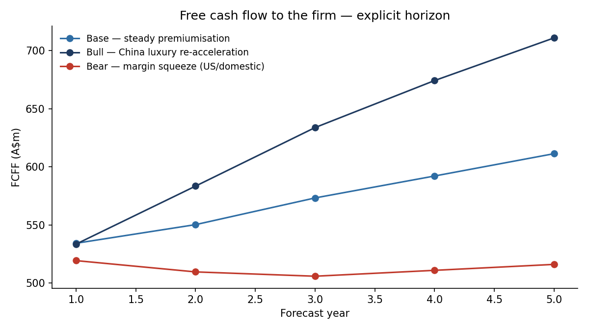
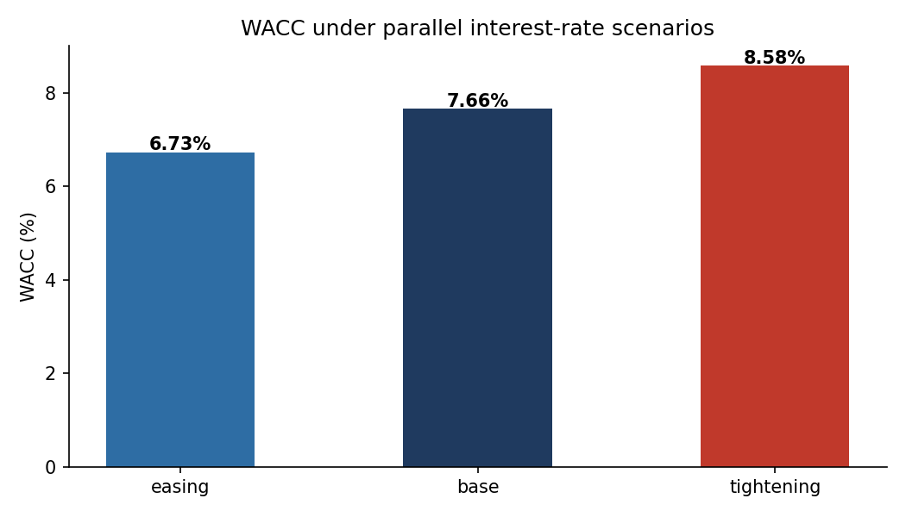

# Treasury Wine Estates (ASX: TWE) — Scenario & Sensitivity Valuation Model

A layered, auditable **DCF valuation model** for Treasury Wine Estates, built the way a
reviewed corporate model should be: assumptions in one sourced input file, pure-function
calculations, hard validation checks that run before any output is written, and
scenario / sensitivity analysis around the two levers that actually move the answer —
**WACC and terminal growth**.

> Built as a public rebuild of client-style work I do as a financial analyst
> (scenario planning and WACC modelling for an Australian wine exporter across
> domestic and China markets) — reconstructed on public data so it can be shared.

---

## Business question

TWE's earnings mix is shifting toward China-led luxury exports while domestic margins
face labour-cost and demand pressure. What is a share worth under coherent
**operating scenarios** (China re-acceleration vs domestic squeeze), and how sensitive
is that value to **funding-cost assumptions** in a moving rate environment?

## Method

```
assumptions/inputs.yaml   ->   src/valuation.py   ->   src/checks.py   ->   outputs/
(single sourced input          FCFF projection         hard bounds +        charts,
 sheet, FY24-based)            CAPM/WACC, DCF,          EV-bridge tie        tables,
                               sensitivity grid         checks               audit log
```

1. **FCFF projection (5 years)** — revenue → EBIT → NOPAT → FCFF walk per scenario,
   with D&A / capex / working capital tied to revenue (documented simplification;
   wine is inventory-heavy, so NWC intensity is a first-class input).
2. **WACC** — CAPM cost of equity + after-tax cost of debt at a target D/V of 25%,
   evaluated under parallel **interest-rate scenarios** (easing / base / tightening).
3. **DCF** — explicit-horizon PV + Gordon terminal value, EV → equity → per share.
4. **Checks before outputs** — margin/tax/growth hard bounds, path-length consistency,
   `g < WACC` guard, EV-bridge tie-out, terminal-value share flagged outside 40–90%.

## Results (illustrative inputs, FY2024-based)

| Scenario | WACC | Value / share | vs A$8.00 snapshot |
|---|---|---|---|
| Bull — China luxury re-acceleration | 7.2% | **A$12.15** | +52% |
| Base — steady premiumisation | 7.2% | **A$10.25** | +28% |
| Bear — domestic margin squeeze | 7.2% | **A$8.38** | +5% |

WACC grid: **6.27% (easing) / 7.20% (base) / 8.12% (tightening)** — a ±100bp parallel
rate shift moves the discount rate by roughly ±90bp at the target capital structure.









**Reading the sensitivity table:** at base-scenario cash flows, the per-share value
spans **A$4.54 – A$11.91** across WACC 7.5–10.5% × terminal growth 1.5–3.5% — the
discount-rate assumption matters more than any single operating lever, which is why
the model treats WACC as a scenario variable rather than a constant. Terminal value
is ~80% of EV, typical for a 5-year explicit window and flagged by the checks layer.

## Run it

```bash
pip install -r requirements.txt
python run_valuation.py        # writes outputs/ and prints the audit log
```

Every run prints the audit log first (input checks → WACC grid → result checks
→ scenario summary) before writing `outputs/`.

## Repo structure

```
assumptions/inputs.yaml    # ALL inputs, sourced & dated — edit here, nowhere else
src/valuation.py           # projection, WACC, DCF, sensitivity (pure functions)
src/checks.py              # hard-bound validation + EV bridge tie-out
run_valuation.py           # entry point: validate -> value -> plot
outputs/                   # generated charts + CSV tables (committed for the README)
```

## Known simplifications

- D&A, capex and working capital scale with revenue; in perpetuity capex (6.0% of
  revenue) sits slightly below D&A (6.2%), which marginally favours terminal FCFF —
  the checks layer flags this on every run so a reviewer can't miss it.
- Single-segment model: TWE's Penfolds / Premium / Commercial divisions are not
  modelled separately; the scenario margin paths proxy for mix shift.
- Net debt is held constant across the horizon (no explicit debt schedule).

## Disclaimer

Inputs approximate TWE's published FY2024 results and mid-2025 market context and are
**deliberately simplified for methodology demonstration**. This is a modelling
portfolio piece, not investment research or advice.
